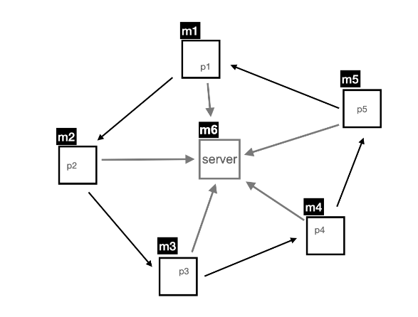
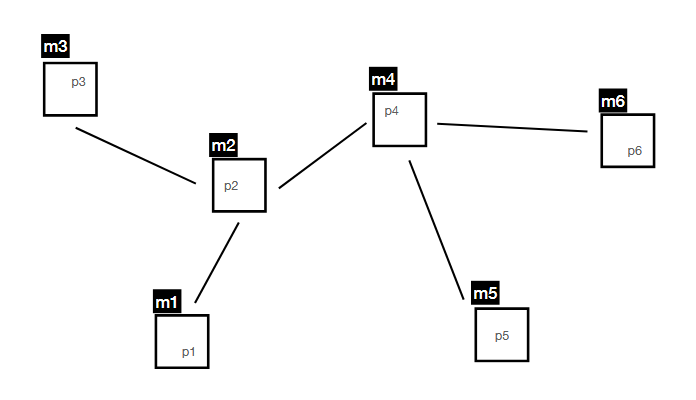
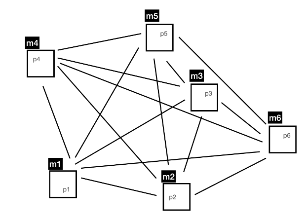

# Distributed Systems

## Project Assignment (2024/2025)
This project was developed within the scope of the **Distributed Systems** course, of the Master's degree in [Network and Information Systems Engineering](https://sigarra.up.pt/fcup/en/CUR_GERAL.CUR_VIEW?pv_ano_lectivo=2024&pv_curso_id=23181) at the [Faculty of Sciences](https://www.up.pt/fcup/en/) of the [University of Porto](https://www.up.pt/portal/en/), implemented in three separate packages. Each one focuses on distributed systems concepts and implements distinct functionalities.

---

### 1. Mutual Exclusion with the Token Ring Algorithm (`ds.assign.trg`)

#### Description
- Implements a token ring network with N peers.
- Ensures mutual exclusion for accessing a calculator multi server.
- Peers communicate in a ring topology and use a token to access the server.
- Each peer generates requests based on a Poisson distribution (4 events/minute).

#### How to Compile
Run the following command in the project root:
```bash
make trg
```

#### How to Execute
1. Start the server on a designated machine:
   ```bash
   ./trg_server.sh <serverHost> <serverPort>
   ```
2. Start each peer on its respective machine:
   ```bash
   ./trg_peer.sh <host> <port> <nextPeerHost> <nextPeerPort> <ServerHost> <ServerPort>
   ```
3. Inject the token into one of the peers to start the token ring:
   ```bash
   ./trg_injector.sh <peerHost> <peerPort>
   ```

#### Notes
- If a peer fails, the ring breaks. Restart the failed peer and re-inject the token to resume operation.

---

### 2. Count the Number of Nodes in a P2P Network (`ds.assign.p2p`)



#### Description
- Implements a P2P network with N peers.
- Each peer maintains a map of connected peers and disseminates the map using the Anti-Entropy Algorithm.
- Updates occur twice per minute following a Poisson distribution.
- Handles peer removal using timestamps for entries, removing peers when they exceed timeout.

#### How to Compile
Run the following command in the project root:
```bash
make p2p
```

#### How to Execute
Start each peer on its respective machine:
```bash
./p2p_peer.sh <host> <port> [<neighborHost> <neighborPort>...]
```

#### Notes
- If a peer fails, its neighbors will keep trying to connection. After a timeout, the failed peer is removed from the network.
- Restarting a failed peer before the timeout allows it to rejoin the network.

---

### 3. A Basic Chat Application Using Totally-Ordered Multicast (`ds.assign.tom`)



#### Description
- Implements a chat application with N peers.
- Ensures a totally ordered sequence of messages using Lamport clocks.
- Messages are sent according to a Poisson distribution (1 event/second).
- Messages are ordered globally before processing, ensuring consistent output across all peers.

#### How to Compile
Run the following command in the project root:
```bash
make tom
```

#### How to Execute
Start each peer on its respective machine:
```bash
./tom_peer.sh <host> <port> [<neighborHost> <neighborPort>...]
```

#### Notes
- Peers not printing the same words, but they are printed in the same order for all peers.

---

### General Notes
- To compile all packages:
  ```bash
  make
  ```
- Grant execution permissions for all shell scrips (`.sh` files):
  ```bash
  chmod +x *.sh
  ```
- To clean up compiled .class files:
    ```bash
    make clean
    ```

### Author
Carlos Santos *201607406*


